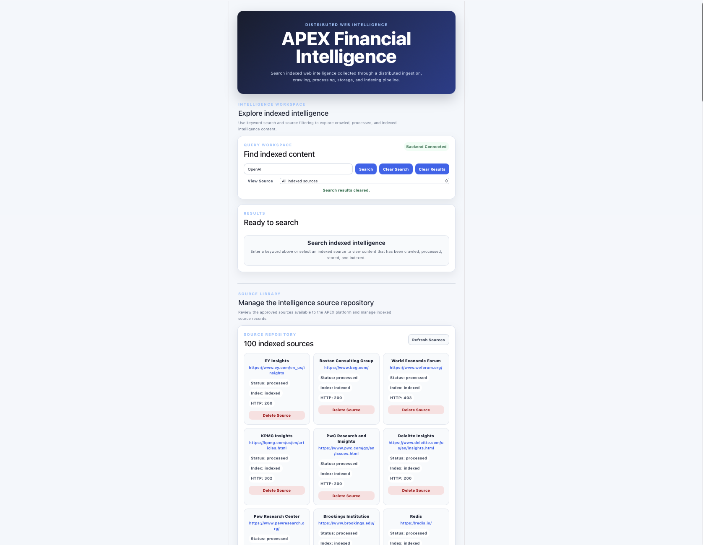
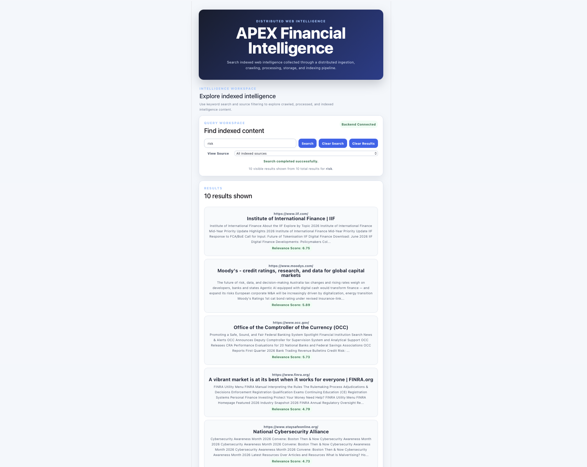
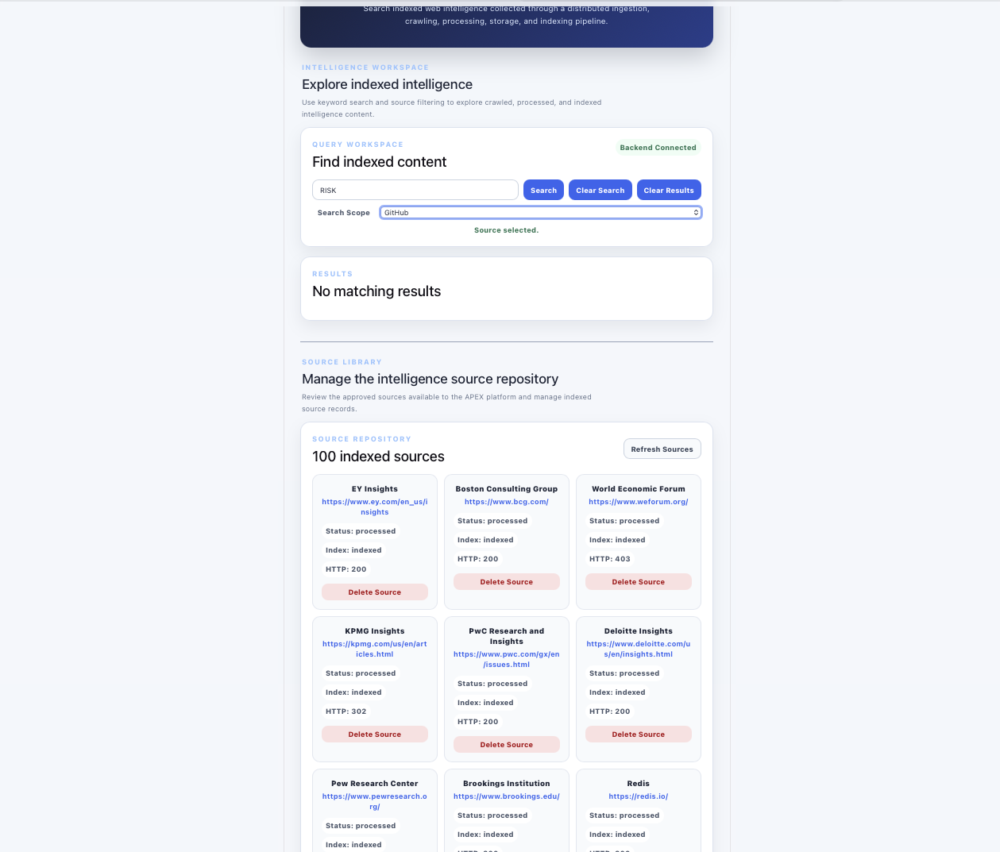
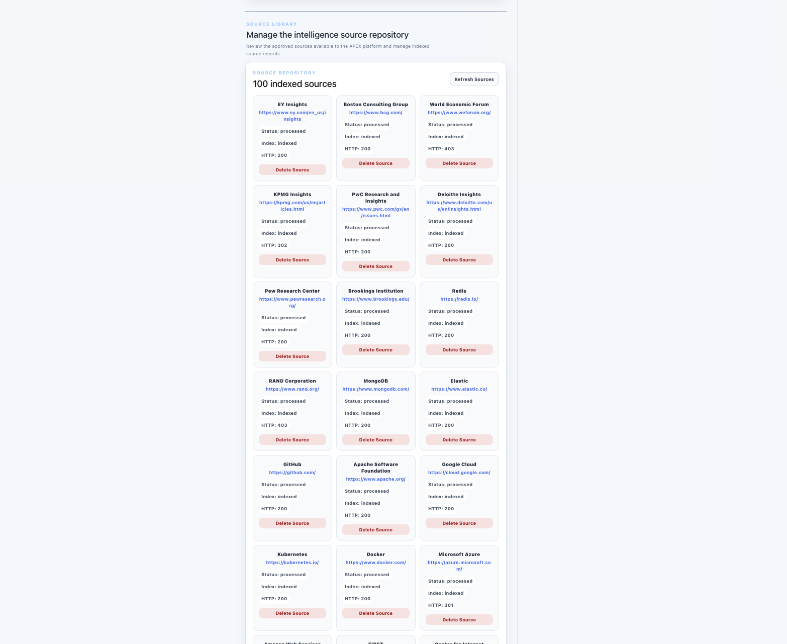
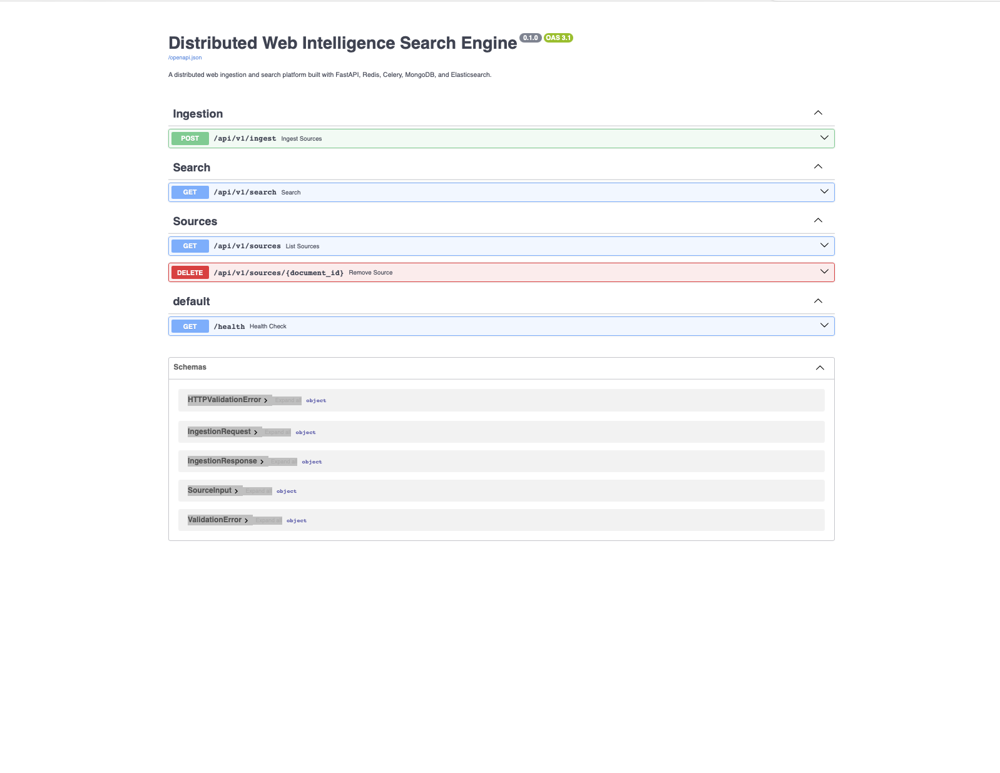
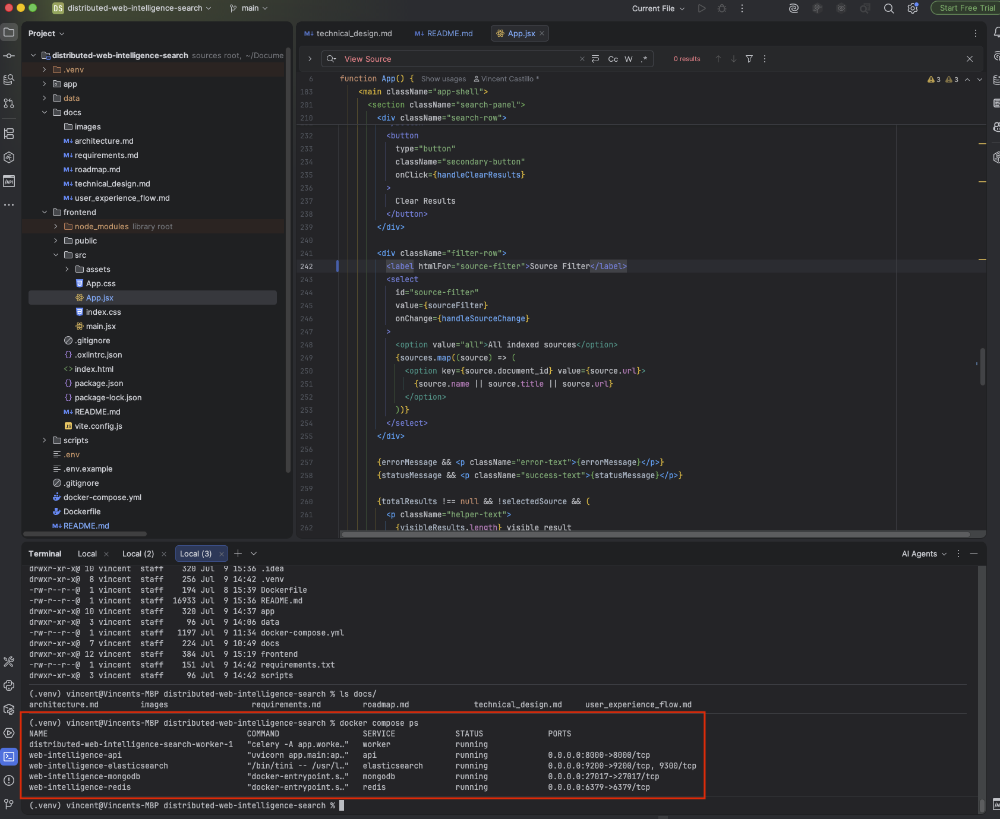

# 🌐 Distributed Web Intelligence Search Engine

A distributed full-stack software engineering application that collects, processes, stores, indexes, searches, and manages intelligence content from approved external web sources.

Built to demonstrate distributed systems architecture, asynchronous background processing, REST API development, NoSQL database integration, full-text search, containerized infrastructure, bulk data ingestion, and enterprise-inspired intelligence search using React, FastAPI, Redis, Celery, MongoDB, Elasticsearch, and Docker.

---

# ⭐ Project Highlights

- Developed a distributed web intelligence search platform
- Built an interactive React intelligence dashboard
- Implemented a FastAPI REST API
- Created asynchronous background processing with Celery
- Integrated Redis as a distributed message broker
- Implemented MongoDB for source records, metadata, and processed content
- Integrated Elasticsearch for full-text indexing and ranked search results
- Developed keyword search and source filtering capabilities
- Created a curated repository of 100 intelligence sources
- Built automated bulk source ingestion
- Implemented source repository management capabilities
- Added duplicate source protection
- Developed source refresh and deletion functionality
- Containerized application infrastructure using Docker
- Integrated Swagger/OpenAPI documentation
- Demonstrated enterprise-inspired distributed systems architecture

---

# 📊 Project Statistics

| Metric | Value |
|---------|------:|
| Frontend Framework | React |
| Backend Framework | FastAPI |
| Programming Languages | Python, JavaScript |
| Message Broker | Redis |
| Background Processing | Celery |
| Primary Database | MongoDB |
| Search Engine | Elasticsearch |
| Infrastructure | Docker |
| Curated Intelligence Sources | 100 |
| Architecture | Distributed Full-Stack |
| Project Status | ✅ Core Application Complete |

---

# 📋 Overview

The Distributed Web Intelligence Search Engine is a distributed full-stack application designed to collect, process, store, index, search, and manage intelligence content from approved external web sources.

The application provides web source ingestion, asynchronous content processing, source metadata management, full-text indexing, keyword search, source filtering, ranked search results, and repository administration through a modern React dashboard backed by a FastAPI REST API and distributed processing architecture.

This project demonstrates modern software engineering principles including distributed systems, asynchronous task processing, message broker integration, NoSQL database design, search engine integration, REST API development, frontend engineering, containerized infrastructure, bulk data ingestion, and version control.

---

# 🎯 Business Scenario

Organizations frequently rely on intelligence distributed across regulatory agencies, government institutions, financial organizations, technology companies, cybersecurity organizations, consulting firms, research institutions, and international organizations.

Business users, analysts, researchers, and technology teams may need to manually visit multiple websites, locate relevant information, compare sources, and organize intelligence across disconnected platforms.

This creates several challenges:

- Fragmented information sources
- Repetitive manual research
- Inconsistent source tracking
- Limited centralized search capabilities
- Difficulty scaling content ingestion
- Inefficient retrieval of relevant intelligence

This project simulates an enterprise web intelligence platform by providing a centralized application that enables users to ingest approved external sources, process web content asynchronously, store source information, index searchable content, retrieve ranked intelligence results, and manage a centralized source repository.

---

# 🚀 Project Objectives

- Build a distributed full-stack intelligence search platform
- Develop a React intelligence dashboard
- Implement a FastAPI REST API
- Demonstrate asynchronous task processing
- Integrate Redis as a distributed message broker
- Implement Celery background workers
- Design a MongoDB data persistence layer
- Integrate Elasticsearch full-text search
- Develop keyword search and source filtering
- Create automated bulk source ingestion
- Build a centralized intelligence source repository
- Demonstrate Docker-based containerized infrastructure
- Showcase enterprise-inspired distributed systems engineering practices

---

# 📈 Current Project Status

## ✅ Completed

- Project Planning
- Requirements Documentation
- Solution Architecture
- Technical Design
- Development Roadmap
- Environment Setup
- Docker Infrastructure
- React Frontend Dashboard
- FastAPI REST API
- Redis Message Broker
- Celery Background Workers
- MongoDB Integration
- Elasticsearch Integration
- Web Source Ingestion
- Asynchronous Content Processing
- Search Indexing
- Keyword Search
- Source Filtering
- Ranked Search Results
- Bulk Source Ingestion
- 100-Source Intelligence Repository
- Source Metadata Management
- Duplicate Source Protection
- Source Refresh Functionality
- Individual Source Deletion
- Dashboard User Interface Refinement
- Swagger/OpenAPI Documentation

## 🔮 Planned

- Deep Recursive Web Crawling
- Multi-Page Content Discovery
- PDF and Document Ingestion
- AI-Powered Retrieval-Augmented Generation (RAG)
- Natural-Language Intelligence Questions
- AI-Generated Intelligence Summaries
- Source Citations
- Automated Testing Suite
- Cloud Deployment
- Application Monitoring and Observability

---

# 🏗️ Architecture

```text
                         React Dashboard
                                │
                                ▼
                         FastAPI REST API
                                │
               ┌────────────────┼────────────────┐
               │                │                │
               ▼                ▼                ▼
           MongoDB            Redis        Elasticsearch
               │                │                │
               │                ▼                │
               │          Celery Workers         │
               │                │                │
               │                ▼                │
               │       Web Content Processing    │
               │                │                │
               └────────────────┼────────────────┘
                                │
                                ▼
                    Searchable Intelligence
```

The application follows a distributed software architecture that separates frontend presentation, API communication, asynchronous processing, message brokering, data persistence, and search indexing into independent components.

This architecture improves separation of responsibilities and demonstrates how multiple application services coordinate to create an end-to-end distributed system.

---

# ⚙️ Application Workflow

1. Users access the React intelligence dashboard.
2. Approved external source URLs are submitted for ingestion.
3. FastAPI validates incoming ingestion requests.
4. Redis acts as the message broker for asynchronous processing.
5. Celery workers process ingestion jobs in the background.
6. Web content is retrieved and processed.
7. MongoDB stores source records, metadata, processing status, and content.
8. Elasticsearch indexes searchable intelligence content.
9. Users enter keywords or phrases through the Query Workspace.
10. Users optionally filter results by indexed source.
11. Elasticsearch retrieves and ranks matching intelligence content.
12. Search results are returned through FastAPI.
13. The React dashboard displays search intelligence and ranked results.
14. Users manage indexed sources through the Source Repository.

---

# 📁 Project Structure

```text
distributed-web-intelligence-search
│
├── app
│   ├── api
│   ├── models
│   ├── services
│   ├── workers
│   └── main.py
│
├── docs
│   ├── requirements.md
│   ├── architecture.md
│   ├── technical_design.md
│   └── roadmap.md
│
├── frontend
│   └── src
│       ├── App.css
│       └── App.jsx
│
├── scripts
│   └── bulk_ingest_sources.py
│
├── docker-compose.yml
├── requirements.txt
└── README.md
```

---

## 📸 Application Screenshots

### Intelligence Dashboard Overview

The APEX dashboard provides a centralized interface for searching indexed intelligence, managing search scope, reviewing search results, and monitoring the indexed source repository.



### Relevance-Ranked Search Results

Keyword searches return relevance-ranked results from indexed intelligence sources, providing source URLs, extracted content, and Elasticsearch relevance scores.



### Search Scope

Users can search across the entire source library or narrow a query to a specific indexed source for more targeted intelligence retrieval.



### Indexed Source Repository

The Source Library provides visibility into the platform's indexed intelligence sources and their ingestion status.



### Interactive API Documentation

FastAPI automatically generates interactive Swagger documentation for exploring and testing the application's API endpoints.



### Distributed Infrastructure

The application runs as a multi-service Docker environment containing the FastAPI application, Celery worker, Redis message broker, MongoDB database, and Elasticsearch search engine.



---

# 🚀 Key Features

## Intelligence Search

- Keyword Search
- Phrase Search
- Indexed Content Retrieval
- Ranked Search Results
- Search Result Count
- Clear Search Functionality

## Source Filtering

- Search All Indexed Sources
- Filter by Individual Source
- Dynamic Source Selection
- Source-Specific Intelligence Retrieval

## Distributed Processing

- Asynchronous Background Processing
- Redis Message Brokering
- Celery Worker Processing
- Non-Blocking Ingestion Workflow
- Distributed Application Architecture

## Search & Indexing

- Elasticsearch Integration
- Full-Text Search
- Searchable Content Indexing
- Ranked Result Retrieval
- Source Metadata Integration

## Data Management

- MongoDB Persistence
- Source Record Storage
- Content Storage
- Metadata Management
- Ingestion Status Tracking

## Bulk Source Ingestion

- Automated Bulk Ingestion Script
- Curated 100-Source Intelligence Repository
- Multi-Category Source Collection
- Duplicate Source Protection

## Source Repository Management

- View Indexed Sources
- Refresh Source Repository
- Review Source Metadata
- Delete Individual Sources
- Repository Status Visibility

## User Experience

- Intelligence Workspace
- Query Workspace
- Search Intelligence Summary
- Ranked Search Results
- Source Library
- Source Repository
- Empty State Messaging
- Responsive Dashboard Layout
- Visual Section Separation
- Refined Information Architecture

---

# 💻 Technology Stack

## Frontend

- React
- JavaScript (ES6+)
- CSS3

## Backend

- Python
- FastAPI
- Uvicorn
- Pydantic

## Distributed Processing

- Celery
- Redis

## Database

- MongoDB

## Search Engine

- Elasticsearch

## Infrastructure

- Docker
- Docker Compose

## API Documentation

- Swagger UI (OpenAPI)

## Development Tools

- Git
- GitHub
- PyCharm
- Visual Studio Code

---

# 🔄 REST API Capabilities

## Source Ingestion

- Submit external sources for ingestion
- Validate ingestion requests
- Track ingestion status
- Prevent duplicate source ingestion

## Intelligence Search

- Search indexed intelligence content
- Filter searches by source
- Retrieve ranked search results
- Return search result counts

## Source Management

- Retrieve indexed sources
- Review source metadata
- Refresh source repository
- Delete individual sources

---

# 🎯 Example Use Cases

## Risk Analyst

Search regulatory, financial, and government intelligence across multiple approved external sources.

## Research Analyst

Retrieve relevant information from a centralized collection of indexed organizations.

## Cybersecurity Analyst

Search intelligence across cybersecurity organizations, technology sources, and government agencies.

## Engineering Team

Manage external data ingestion, background processing, indexing, and distributed application services.

## Technology Leader

Evaluate the architecture, health, scalability, and capabilities of a distributed intelligence platform.

---

# 🎯 Skills Demonstrated

- Software Engineering
- Distributed Systems
- Full-Stack Development
- Frontend Engineering
- Backend API Development
- REST API Development
- Asynchronous Processing
- Message Broker Integration
- Background Worker Architecture
- NoSQL Database Integration
- Search Engine Integration
- Full-Text Search
- Information Retrieval
- Data Ingestion
- Bulk Data Processing
- Metadata Management
- Containerization
- Docker Infrastructure
- Source Repository Management
- Dashboard Development
- User Interface Design
- Information Architecture
- Software Development Lifecycle (SDLC)
- Technical Documentation
- Git Version Control

---

# ⚙️ Installation

## Clone Repository

```bash
git clone <repository-url>
```

## Create Virtual Environment

```bash
python -m venv .venv
```

## Activate Virtual Environment

### macOS / Linux

```bash
source .venv/bin/activate
```

### Windows

```bash
.venv\Scripts\activate
```

## Install Python Dependencies

```bash
pip install -r requirements.txt
```

## Start Docker Infrastructure

```bash
docker compose up -d
```

## Start FastAPI Backend

```bash
uvicorn app.main:app --reload
```

## Start Celery Worker

```bash
celery -A app.workers.celery_app.celery_app worker --loglevel=info
```

## Start React Frontend

```bash
cd frontend

npm install

npm run dev
```

## Bulk Ingest Intelligence Sources

From the project root:

```bash
python scripts/bulk_ingest_sources.py
```

## Access Applications

**React Dashboard**

```text
http://localhost:5173
```

**Swagger UI**

```text
http://127.0.0.1:8000/docs
```

---

# 🧪 Testing & Validation

The core application workflow has been manually tested and validated across the distributed system.

## Infrastructure Validation

- Docker Services
- Redis Connectivity
- MongoDB Connectivity
- Elasticsearch Connectivity
- Celery Worker Availability

## Backend Validation

- FastAPI Application Startup
- API Endpoint Availability
- Swagger UI Availability
- Individual Source Ingestion
- Bulk Source Ingestion
- Duplicate Source Protection
- Asynchronous Task Processing

## Search Validation

- Elasticsearch Indexing
- Keyword Search
- Phrase Search
- Source Filtering
- Ranked Result Retrieval
- Search Result Counts

## Frontend Validation

- React and FastAPI Integration
- Intelligence Workspace
- Query Workspace
- Search Results
- Source Filtering
- Source Repository Refresh
- Source Deletion
- Empty State Messaging
- Dashboard Layout
- User Experience Refinements

---

# ⚠️ Known Limitations

## Single-Page Source Processing

The current ingestion process retrieves and processes content from the submitted source URL.

The crawler does not yet recursively discover additional pages, documents, and links within the source domain.

## Website Access Restrictions

Some external websites may block automated requests, apply rate limits, require JavaScript rendering, or return HTTP errors.

## No AI-Generated Intelligence Synthesis

The current application provides keyword search and ranked information retrieval.

The system does not yet use an AI model to synthesize retrieved information into natural-language answers.

## Local Development Environment

The current application is designed and tested within a local Docker-based development environment.

Cloud deployment and production infrastructure are outside the current core project scope.

## Manual Testing Focus

The primary end-to-end application workflow has been manually validated.

A comprehensive automated unit, integration, and end-to-end testing suite has not yet been implemented.

---

# 🔮 Future Enhancements

- Deep Recursive Web Crawling
- Multi-Page Content Discovery
- PDF and Document Ingestion
- AI-Powered Retrieval-Augmented Generation (RAG)
- Natural-Language Intelligence Questions
- AI-Generated Intelligence Summaries
- Grounded AI Responses
- Source Citations
- Automated Unit Testing
- Integration Testing
- End-to-End Testing
- Cloud Deployment
- Application Monitoring
- System Observability
- Enhanced Crawler Failure Handling
- Advanced Source Repository Management

---

# 📚 Documentation

Detailed project documentation is available in the `docs/` folder:

- `requirements.md`
- `architecture.md`
- `technical_design.md`
- `roadmap.md`

---

# ✅ Project Status

**Version:** 1.0

**Project Status:** ✅ Core Application Complete

The Distributed Web Intelligence Search Engine demonstrates a distributed enterprise-inspired full-stack software engineering application utilizing modern frontend development, REST API architecture, asynchronous background processing, message brokering, NoSQL data persistence, full-text search, containerized infrastructure, bulk source ingestion, intelligence retrieval, and source repository management.

The completed core application provides a foundation for future advanced capabilities including deep recursive web crawling and AI-powered Retrieval-Augmented Generation.